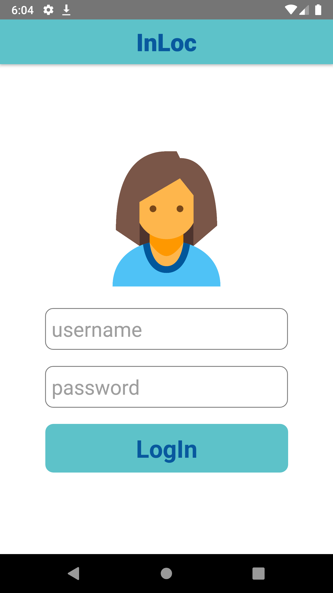
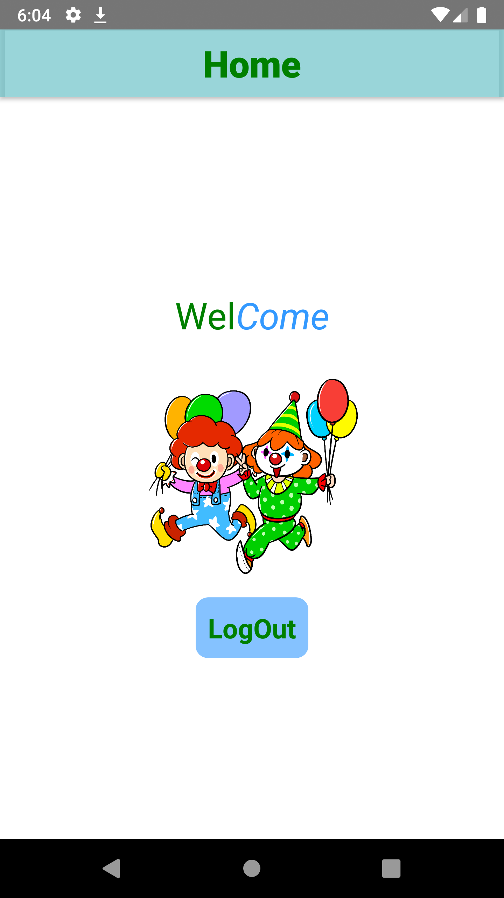

# InLoc - Simple Login App

- [x] login with username and password
- [x] navigation between login and home screen
- [x] logout 

## Using
- React Native
- React Native CLI

## Install 

# ScreenShots

